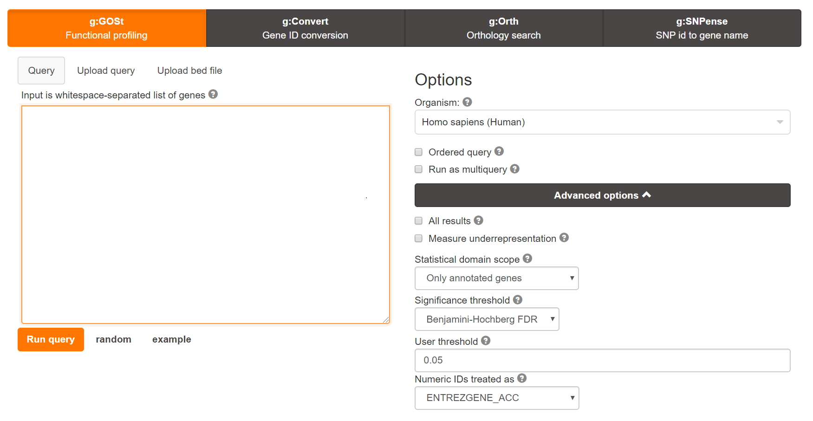

Load modules to be used in this notebook. Render Assignment 1.

```{r}
if (!requireNamespace("BiocManager", quietly = TRUE))
    install.packages("BiocManager")

BiocManager::install("GEOquery")
BiocManager::install("knitr")
BiocManager::install("ComplexHeatmap")
BiocManager::install("circlize")
BiocManager::install("edgeR")
BiocManager::install("EnhancedVolcano")

library(knitr)
library(ComplexHeatmap)
library(circlize)
library(edgeR)
library(EnhancedVolcano)

```

**INTRO**

Data was refined from the GSE141220 accession in the GEO database. This accession represents a study done in a Burkitt Lymphoma cell line positive for Epstein-Barr Virus. Viral reactivation from latency was induced using sodium butyrate = NaB, and Illumina HiSeq 2500 reads were compared to uninduced cells at three time points: three hours post-induction, 24 hours post-induction, and 48 post-induction. The paper aimed to identify cellular factors upstream of viral reactivation; thus the three-hour time point was included, as viral factors are not being expressed yet

Data was filtered to exclude low-value genes.
Data was normalized using the TMM method. Ensembl IDs were mapped to HUGO gene symbols. Mappings to whitespace characters were identified for later consideration. Two sets of duplicate entries were identified, corresponding to lncRNAs, and collapsed into the identifier corresponding to the longer variant. The data was separated into two tables: one of which contained counts with successful HUGO mappings, and another which contained counts identifiable only by ensemblIDs.


**Loose Ends and Selection of Dataset for Analysis**

In the submitted version of Assignment 1, the final data was not shown, it was not saved to an output file, and MDS plots were not generated. Two saveRDS() calls were added to the A1 file. We load data from the saved file, output sample HTML tables of our datasets (Table 1, 2), and generate MDS plots.

```{r, fig.cap="1"}
# Read tables from saved files.
counts_HUGO <- readRDS("HGNC_Labels.rds")
counts_eID <- readRDS("Ensembl_Labels.rds")
samples = rep(1:6, each=2)

# A sample of the full tables is visualized.
kable(counts_HUGO[1:10,1:16], caption = "Table 1: Counts with HUGO Mappings. Counts which could successfully be mapped to HUGO identifiers.", format = "pandoc")
kable(counts_eID[1:10,1:15], caption = "Table 2: Counts without HUGO Mappings. Counts which couldn't be successfully mapped to HUGO identifiers - the reason for this is not clear.", format = "pandoc")

# Make MDS plots of successful HUGO mappings.
plotMDS(counts_HUGO[5:16], labels=colnames(counts_HUGO[5:16]), col=c("darkgreen", "blue", "red", "magenta", "yellow", "cyan")[factor(samples)])
plotMDS(counts_eID[4:15], labels=colnames(counts_eID[4:15]), col=c("darkgreen", "blue", "red", "magenta", "yellow", "cyan")[factor(samples)])
```


Upon generation of MDS plots for either data set, a curious pattern emerges. The HUGO dataset seems to group consistently within timepoints, and the relative distances are exactly as expected. The UnTreated samples gradually change from the 3h time point up to 48h, presumably due to transcriptional changes as the cultures are maintained longer, and some baseline level of viral reactivation. The NaB-treated sample at 3 hours clusters far from the other NaB-treated samples, due to the effect of NaB exposure, with no role yet played by viral proteins; later clusters are closer together because progressive viral replication is ongoing, and viral proteins are affecting the cell's functions.

On the other hand, the eID dataset clusters oddly. The UnTreated samples roughly recapitulate the same pattern as for the HUGO label genes. However, clustering across timepoints is seen for the 24h and 48h NaB-treated samples.  This was not due to erroneous table construction on our end, as GEO names were iterated over to construct the table on a per-column basis. The following code chunk uses the same loop as the table construction, but outputs sample names instead, to demonstrate that the error was not introduced at this point.


```{r}
# Get sample GEO codes and sample filenames from series
series <- GEOquery::getGEO("GSE141220")
sampleFileNames <- unlist(strsplit(series$GSE141220_series_matrix.txt.gz@experimentData@other$sample_id, split="\\s"))
sampleNames <- as.vector(series$GSE141220_series_matrix.txt.gz@phenoData@data$title)

# Pull names from individual sample accessions
verifyNames <- vector("character", 12)
i <- 1
for (s in sampleFileNames)
{
  sfile <- GEOquery::getGEO(s)
  verifyNames[i] <- sfile@header$title
  i <- i+1
}

# Show that the names extracted from the series accession match the names extracted from the samples
comparisonTable <- data.frame(namesFromSeries = sampleNames, namesFromSamples = verifyNames)
rownames(comparisonTable) <- sampleFileNames
kable(comparisonTable, caption = "Table 3: A comparison of file names as extracted from the series metadata vs. as extracted from the sample accession directly.", format = "pandoc") 
```


This indicates that no labeling error was introduced during data construction (Table 3). Potentially, the data was incorrectly uploaded to the GEO database. Another possibility is that the second replicates of these points were somehow treated differently, and massive experimental bias was introduced.

In any case, as only the HUGO-labeled data set will be used in the enrichment, this drastic difference will not come into play (though the underlying quality of the data remains questionable, and it may explain any oddities between the samples which may come up during the course of this analysis). This highlights the importance of figuring out why the HUGO mapping was so inefficient, and how these gene sets are different - which will be done separately after assignment submission and can be found on the wiki.


**Differential Gene Expression**


We begin by making a row-normalized heatmap, to obtain a preliminary visualization of the difference between samples.


```{r}
# Define initial heatmap matrix
heatmap_matrix <- counts_HUGO[,5:ncol(counts_HUGO)]
rownames(heatmap_matrix) <- counts_HUGO$hgnc_symbol
colnames(heatmap_matrix) <- colnames(counts_HUGO[,5:ncol(counts_HUGO)])

# Normalize the heatmap
heatmap_matrix <- t(scale(t(heatmap_matrix)))
if(min(heatmap_matrix) == 0){
    heatmap_col = colorRamp2(c( 0, max(heatmap_matrix)), c( "white", "red"))
  } else {
    heatmap_col = colorRamp2(c(min(heatmap_matrix), 0, max(heatmap_matrix)), c("blue", "white", "red"))
  }
current_heatmap <- Heatmap(as.matrix(heatmap_matrix), show_row_dend = TRUE, show_column_dend = TRUE, col=heatmap_col, show_column_names = TRUE, show_row_names = FALSE, show_heatmap_legend = TRUE)

# Display the heatmap
current_heatmap
```


We see that there is a distinct transcription program occurring at later time points when the virus is induced, as would be expected. At the 3h time point we find that expression is more similar to the untreated samples than it is to later NaB samples. Interestingly, we see that replicates are clustered more closely than time points in certain cases - UT 3h / 24h, NaB 24h / 48h - as with our earlier observation regarding the MDS plot. Since the heatmap allows us to compare genewise expression at a glance, it is more informative in this regard than the MDS plot, with its abstracted coordinate method.

Next, we will model the data to identify the top genes which are differentially expressed. Treatment status and time point are expected to contribute to differential expression. Given the differences observed between replicates thus far, it was decided to include this factor in the analysis also. Two models will be compared at this point: one ignoring the difference between replicates, and another accounting for replicate identity. The edgeR package was used as it is intended for the processing of RNAseq data. Dispersion estimation was followed by a Quasi-Likelihood test given that this was bulk RNAseq data.

(To be clear, I am genuinely unsure whether this distinction should be made - I am not just imitating the lecture 5 notes. )


```{r}
# Split samples according to different properties, for later grouping
modelDF <- data.frame(lapply(colnames(counts_HUGO)[5:16], FUN=function(x){
    unlist(strsplit(x, split = "\\_"))[c(1,2,4)]}))
colnames(modelDF) <- colnames(counts_HUGO)[5:16]
rownames(modelDF) <- c("treatment","time","rep")
modelDF <- data.frame(t(modelDF))
# Give compact sample of table
modelDF[1:3,]

# Define two models
modelNoRep <- model.matrix(~ modelDF$treatment + modelDF$time)
modelRep <- model.matrix(~ modelDF$treatment + modelDF$time + modelDF$rep)

# Fit data to model not considering replicate identity 
d1 = DGEList(counts=as.matrix(counts_HUGO[5:16]), group=modelDF$treatment)
d1 <- estimateDisp(d1, modelNoRep)
fit1 <- glmQLFit(d1, modelNoRep)

# Fit data to model considering replicate identity
d2 = DGEList(counts=as.matrix(counts_HUGO[5:16]), group=modelDF$treatment)
d2 <- estimateDisp(d2, modelRep)
fit2 <- glmQLFit(d2, modelRep)

# Get top hits according to each model
qlf.noRep <- glmQLFTest(fit1, coef="modelDF$treatmentUT")
qlf.rep <- glmQLFTest(fit2, coef="modelDF$treatmentUT")
hitsNoRep <- topTags(qlf.noRep, sort.by = "PValue", n=nrow(counts_HUGO))
hitsRep <- topTags(qlf.rep, sort.by = "PValue", n=nrow(counts_HUGO))

# Merge top hits of both models into one DF for plotting
hitsNoRep_PValues <- data.frame(
          hngc = rownames(hitsNoRep$table),
          noRep_PValue=hitsNoRep$table$PValue)
hitsRep_PValues <- data.frame(
          hngc = rownames(hitsRep$table),
          rep_PValue=hitsRep$table$PValue)
two_models_PValues <- merge(hitsNoRep_PValues,
                            hitsRep_PValues,
                            by.x=1,by.y=1)

# Plot without axes restriction
two_models_PValues$colour <- "black"
two_models_PValues$colour[two_models_PValues$noRep_PValue<0.05] <- "orange"
two_models_PValues$colour[two_models_PValues$rep_PValue<0.05] <- "blue"
two_models_PValues$colour[two_models_PValues$noRep_PValue<0.05 & two_models_PValues$rep_PValue<0.05] <- "red"
plot(two_models_PValues$noRep_PValue,
     two_models_PValues$rep_PValue,
     col = two_models_PValues$colour,
     xlab = "No Replicate model p-values",
     ylab ="Replicate model p-values",
     main="Distinguishing Reps vs. Not")
legend("topleft", 
       legend = c("Sig. without replicates", "Sig. with replicates", "Sig. in both cases"),
       col = c("orange", "blue", "red"),
       pch = 1,
       bty = "o",
       horiz = F,
       inset = c(0.05, 0.05))

# Plot zoomed in up to a p-value of 0.1
plot(two_models_PValues$noRep_PValue,
     two_models_PValues$rep_PValue,
     col = two_models_PValues$colour,
     xlab = "No Replicate model p-values",
     ylab ="Replicate model p-values",
     main="Distinguishing Reps vs. Not, Zoomed",
     xlim = c(0, 0.1),
     ylim = c(0, 0.1))
legend("topleft", 
       legend = c("Sig. without replicates", "Sig. with replicates", "Sig. in both cases"),
       col = c("orange", "blue", "red"),
       pch = 1,
       bty = "o",
       horiz = F,
       inset = c(0.05, 0.05))

```


This highly linear relationship means that there is not much difference between the models - and this was predctable given that the same calculation is being done with slightly different parameters. Note that a distinguishable proportion of genes falls under this line, while few fall above it. Those genes which are significant according to the no-replicate model, but not the replicate model, are so few as to be invisible until the graph is zoomed in. Meanwhile, zooming the graph shows us that there aren't as many blue points as it seems at first glance.  

By accounting for the differences between replicates, we find more significant genes. As a result of this comparison it was decided that the replicate model would be used. Let's see how many genes were significantly differentially expressed, and how many survive correction. Thresholds of 0.05 will be used in both cases; the false discovery rate is calculated alongside the p value by the quasi-likelihood test.

Significant genes:
```{r}
print(length(which(hitsRep$table$PValue < 0.05)))
```

Significant genes which pass correction:
```{r}
print(length(which(hitsRep$table$PValue < 0.05 & hitsRep$table$FDR < 0.05)))
```

```{r}
# Separate out significant genes which pass correction.
filteredHits <- hitsRep$table[which(hitsRep$table$PValue < 0.05 & hitsRep$table$FDR < 0.05),]
```


Let's make a heatmap of only the genes which are represented in this cohort.


```{r}
# Isolate represented genes
top_hits <- rownames(hitsRep$table)[hitsRep$table$PValue<0.05 & hitsRep$table$FDR<0.05]
heatmap_matrix_tophits <- t(
  scale(t(heatmap_matrix[which(rownames(heatmap_matrix) %in% top_hits),])))
if(min(heatmap_matrix_tophits) == 0){
    heatmap_col = colorRamp2(c( 0, max(heatmap_matrix_tophits)), 
                             c( "white", "red"))
  } else {
    heatmap_col = colorRamp2(c(min(heatmap_matrix_tophits), 0, max(heatmap_matrix_tophits)), c("blue", "white", "red"))
  }

# Display heatmap clustered
current_heatmap <- Heatmap(as.matrix(heatmap_matrix_tophits),
                           cluster_rows = TRUE,
                           cluster_columns = TRUE,
                               show_row_dend = TRUE,
                               show_column_dend = TRUE, 
                               col=heatmap_col,
                               show_column_names = TRUE, 
                               show_row_names = FALSE,
                               show_heatmap_legend = TRUE,
                               )
current_heatmap

# Display heatmap with columns not clustered
current_heatmap <- Heatmap(as.matrix(heatmap_matrix_tophits),
                           cluster_rows = TRUE,
                           cluster_columns = FALSE,
                               show_row_dend = TRUE,
                               show_column_dend = TRUE, 
                               col=heatmap_col,
                               show_column_names = TRUE, 
                               show_row_names = FALSE,
                               show_heatmap_legend = TRUE,
                               )
current_heatmap
```


Finally, we visualize the differentially expressed genes using a volcano plot. The EnhancedVolcano package was used for this task.


```{r}
EnhancedVolcano(hitsRep$table,
                lab = rownames(hitsRep$table),
                x = 'logFC',
                y = 'PValue',
                xlim = c(-5, 8))
```


From the volcano plot, we see that some of the highly-significant upregulated genes include TRDC, KCNQ5, and PTPN7, while some of the highly-significant downregulated genes include NEBL and RNF217. These proteins have a variety of diverse functions: TRDC is the T-cell delta constant region variant; KCNQ5 is a potassium channel expressed in parts of the brain and in skeletal muscle; and PTPN7 is a protein tyrosine phosphatase which promotes cell growth and differentiation. Meanwhile, NEBL is an actin-remodeling protein expressed in cardiac muscle, while RNF217 is a ubiquitin protein ligase known to be inactivated in certain cancers. We see hints of oncogenic potential in the upregulation of PTPN7 and downregulation of RNF217, but there are also random genes that should by rights be expressed only in highly-differentiated tissues. We reserve further judgement for the thresholded analysis.

Notice that the volcano plot suggests most of our genes are downregulated, while the heat map suggests they're mostly upregulated. This is likely an error as explained in the following section.


**Thresholded Over/Under-Representation Analysis**

```{r}
finalHits_Upreg <- filteredHits[which(filteredHits$logFC > 0), ]
finalHits_Downreg <- filteredHits[which(filteredHits$logFC < 0), ]
```


With a threshold of p < 0.05, we have this many upregulated genes:
```{r}
print(length(finalHits_Upreg$PValue))
```


With a threshold of p < 0.05, we have this many downregulated genes:
```{r}
print(length(finalHits_Downreg$PValue))
```


Looking at our heat map, we see that there is most likely a mixup, as the heat map suggests many more genes are upregulated in the treatment group than downregulated. This could be a result of the NaB treatment being considered as the baseline, rather than the untreated group. As a kludgy fix for this we'll just invert the signs on the log fold-change for now, and reassign the finalHits dataframes accordingly.


```{r}
filteredHits$logFC <- -filteredHits$logFC
finalHits_Upreg <- filteredHits[which(filteredHits$logFC > 0), ]
finalHits_Downreg <- filteredHits[which(filteredHits$logFC < 0), ]
```


With a threshold of p < 0.05, we have this many upregulated genes:
```{r}
print(length(finalHits_Upreg$PValue))
```


With a threshold of p < 0.05, we have this many downregulated genes:
```{r}
print(length(finalHits_Downreg$PValue))
```


To run an analysis on these lists, we must first export genesets.

```{r}
write.table(rownames(filteredHits), file = "totalHits.txt", sep = "\n", row.names = FALSE, col.names = FALSE, quote = FALSE)
write.table(rownames(finalHits_Upreg), file = "upregHits.txt", sep = "\n", row.names = FALSE, col.names = FALSE, quote = FALSE)
write.table(rownames(finalHits_Downreg), file = "downregHits.txt", sep = "\n", row.names = FALSE, col.names = FALSE, quote = FALSE)

```


These gene sets will be analyzed with g:profiler, more specifically the g:GOSt module. This tool was selected because the annotation dataset I selected for the in-class homework assignment deals with viral insertion sites in the human genome, which is not relevant to EBV since it doesn't do this. g:profiler is not only familiar, since it was used in class, but also useful - we have no idea about the function of the genes which are differentially expressed in our dataset.

Benjamini-Hochberg FDR was used to determine significance and false detections (Fig. 1). The thresholded gene sets were exported in text format, which was then used in a g:profiler analysis. The data sources used were the GO biological process, the Reactome pathway database, and WikiPathways (Fig. 2).





No drastic association was visible on the basis of the total DE data, uncategorized into up/downregulated lists. I suspected that these results were being dominated by the more differenetial expression category, and this instinct was confirmed when the other queries were examined. The strongest associations for the unsorted data lay with cellular organization (Fig. 3).


Analyzing the upregulated gene list - which constituted a greater proportion of the total gene data than the downregulated gene list did - it was clear that it contributed more to the results of the total unsorted query; this query is also dominated by cellular organization terms.

We also see a number of terms relating to neuronal organization (Fig. 4). The Reactome data shows an equivalent association with muscle funtion and neuronal pathways (Fig. 5), a puzzling correlation at first - but a common factor does exist here, that being actin remodeling and function. A more interesting association is with neuronal signaling; but as neurotransmitters are transported along axons by transport proteins, this could merely be another correlation caused by actin-associated genes.


The downregulated gene list showed a number of associations much stronger than had been seen for the upregulated list, mostly involved in a variety of semi-related metabolic processes (Fig. 6). At first this was a bit daunting to interpret, but the Reactome data showed a very strong association with RNA metabolism, which we attempted to elucidate further - the terms was thus thresholded on the basis of size.


When this data was thresholded on the basis of dataset size, we see more precise (if weaker) associations come to the forefront. Instead of "cellular nitrogen compound metabolic process" we now see RNA metabolism and ribosome biogenesis taking the top spots (Fig. 9).


**Interpretation**

We've already interpreted the results in various places throughout this assignment, but now we'll take the opportunity to discuss ties to the literature and previous research.

The upregulation of actin remodeling pathways has been previously noted in the later stages of EBV infection, along with cytoskeletal binding proteins (Price et al.) - presumably including the transport proteins involved in neuronal signaling down the length of axons (Figs. 4,5). The same is true for the downregulated pathways. We identified RNA synthesis, export, and metabolism as downregulated areas; previous research has demonstrated that these activities are downregulated, with EBV proteins taking over crucial roles in transcription and RNA processing for viral RNAs. (Park et al.). 

Our findings aren't precisely the same as the source paper (Frey et al.), which aimed mostly to identify associations at the three-hour time point, before viral transcription started. It sought to identify factors that were upstream of viral transcription. However, some of our findings are corroborated, especially regarding the GSEA they performed. They identified that upregulated genes were involved in amoebiasis, cell-cell adhesion, and olfactory transduction (a type of neural signaling); and that downregulated genes were involved in RNA transport and metabolism, and ribosome biogenesis (the third result for our thresholded downregulation GSEA (Fig. 9)). 

One interesting contrast with the source paper is that they noted three times more genes that were downregulated - our data had the opposite imbalance, with three times more upregulated genes after we manually adjusted our log fold-differences due to a supposed incorrect modelling. And yet, the aforementioned similarities with the literature. How this fact ties in with our similar results in other ways (and our general agreement with the literature) may be due to the lack of a HUGO mapping step on their part - again raising questions as to what the difference was between the genes which could be mapped to HUGO and those which couldn't.


**R Modules Used**

The following R modules were used in this project: GEOquery, knitr, ComplexHeatmap, circlize, edgeR, EnhancedVolcano

**References**

For whatever reason the automatic Rmarkdown bibliography syntax isn't working.

Price AM, Tourigny JP, Forte E, Salinas RE, Dave SS, Luftig MA. 2012. Analysis of Epstein-Barr Virus-Regulated Host Gene Expression Changes through Primary B-Cell Outgrowth Reveals Delayed Kinetics of Latent Membrane Protein 1-Mediated NF- B Activation. J Virol. doi:10.1128/jvi.01069-12.

Park R, Miller G. 2018. Epstein-Barr Virus-Induced Nodules on Viral Replication Compartments Contain RNA Processing Proteins and a Viral Long Noncoding RNA. J Virol. doi:10.1128/jvi.01254-18.

Frey TR, Brathwaite J, Li X, Burgula S, Akinyemi IA, Agarwal S, Burton EM, Ljungman M, McIntosh MT, Bhaduri-McIntosh S. 2020. Nascent transcriptomics reveal cellular pro-lytic factors upregulated upstream of the latency-to-lytic switch protein of Epstein-Barr virus. J Virol. doi:10.1128/jvi.01966-19.


