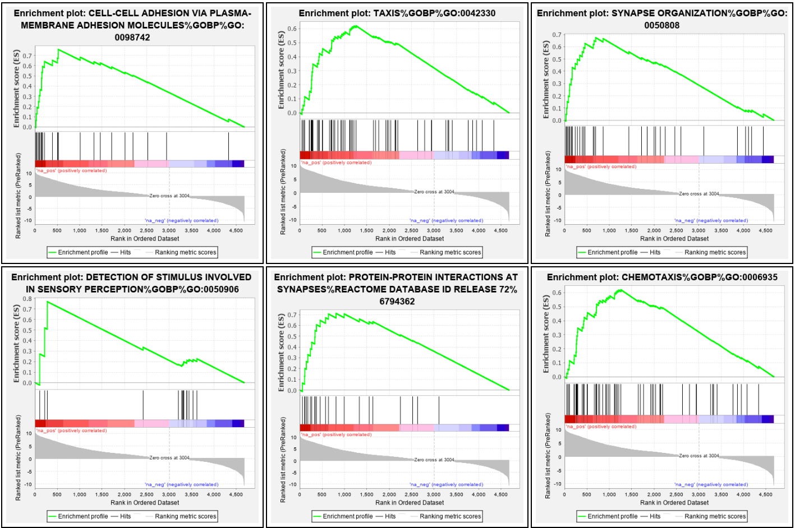
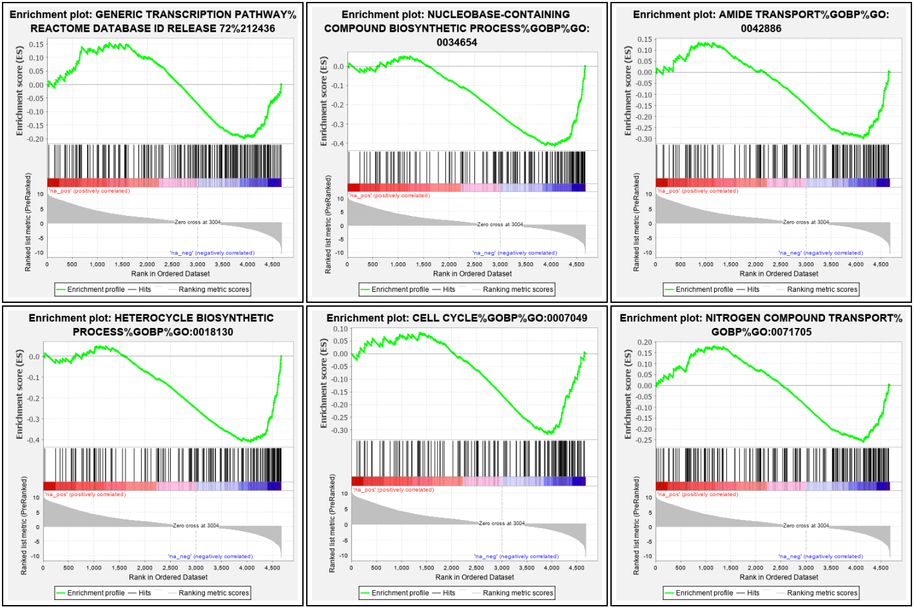
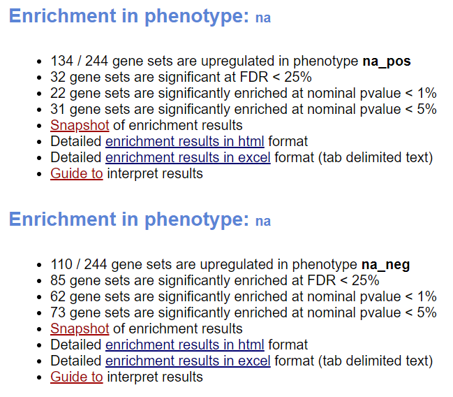
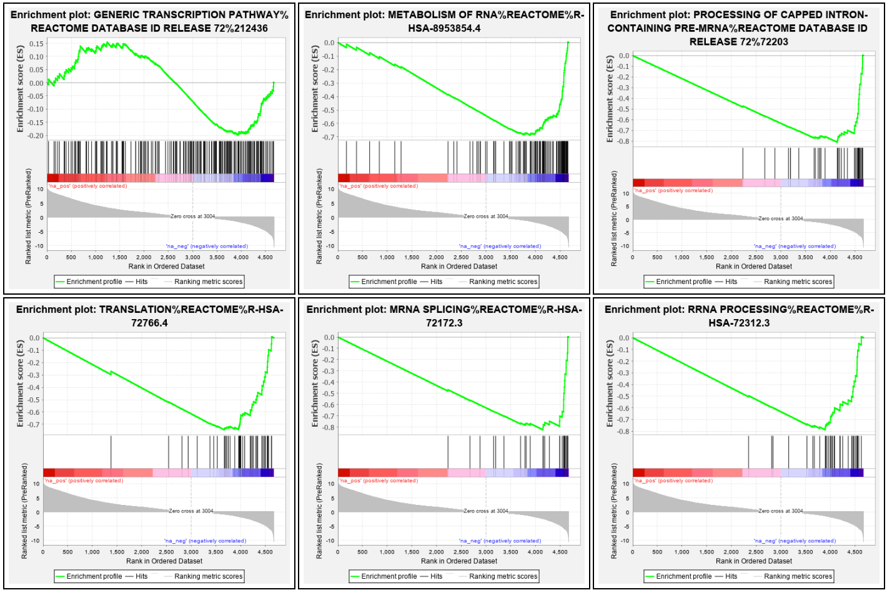
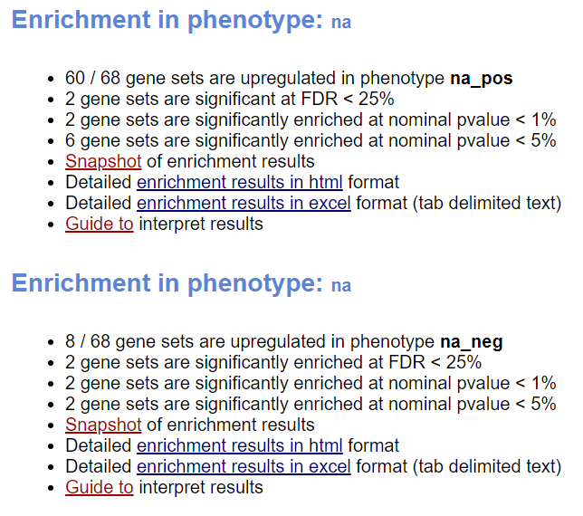
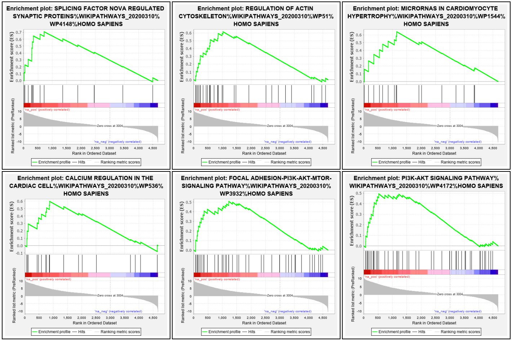
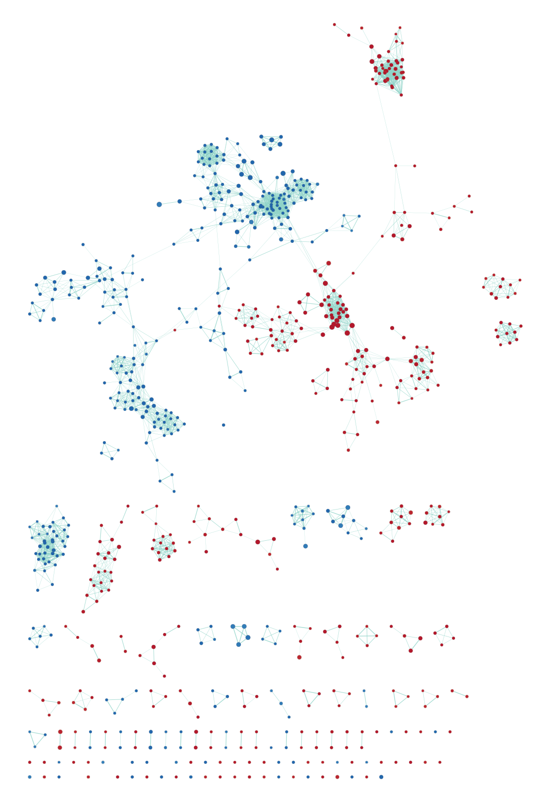
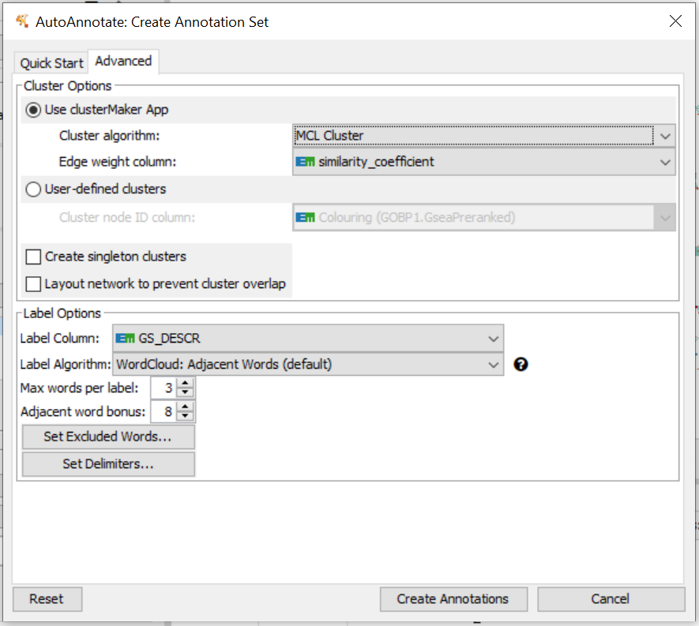
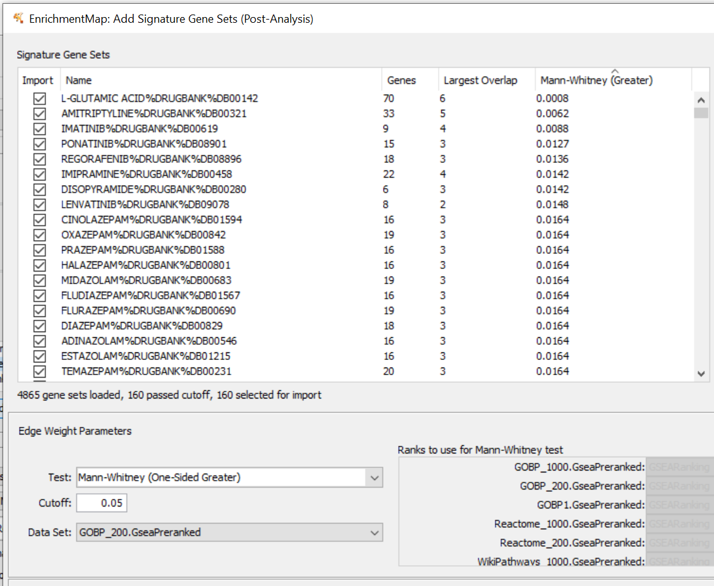
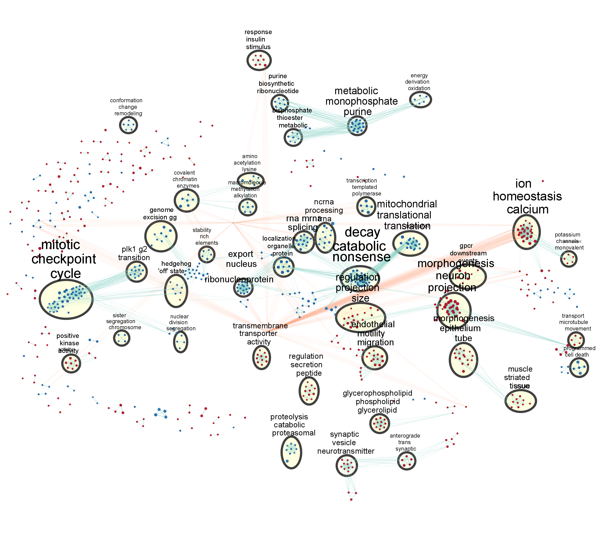

<details>
  <summary>Renders</summary>
```{r}
knitr::opts_chunk$set(options(knitr.duplicate.label = "allow"))
rmarkdown::render("BCB420_A1_DimitrijeRatkov.Rmd")
rmarkdown::render("BCB420_A2S_DimitrijeRatkov.Rmd")
```
</details>

## INTRODUCTION

We introduce the work done in A1 and A2. We render A1 and A2 to ensure all previous analyses are loaded.


### Assignment 1

As part of the data processing done in Assignment 1, data was refined from the GSE141220 accession in the GEO database. This accession represents a study done in a Burkitt Lymphoma cell line positive for Epstein-Barr Virus (Frey et al.). Viral reactivation from latency was induced using sodium butyrate = NaB, and Illumina HiSeq 2500 reads were compared to uninduced cells at three time points: three hours post-induction, 24 hours post-induction, and 48 post-induction. The paper aimed to identify cellular factors upstream of viral reactivation; thus the three-hour time point was included, as viral factors are not being expressed yet.

Data was filtered to exclude low-value genes.
Data was normalized using the TMM method. Ensembl IDs were mapped to HUGO gene symbols. Mappings to whitespace characters were identified for later consideration. Two sets of duplicate entries were identified, corresponding to lncRNAs, and collapsed into the identifier corresponding to the longer variant. The data was separated into two tables: one of which contained counts with successful HUGO mappings, and another which contained counts identifiable only by ensemblIDs.

<details>
  <summary>Assignment 1</summary>
```{r, child="BCB420_A1_DimitrijeRatkov.Rmd"}
```
</details> 


### Assignment 2

Before the analyses to be done in Assignment 2, all Assignment 1 requirements were fulfilled. This included a visualization of the counts as an HTML table, and as MDS plots. MDS plotting revealed that HUGO results grouped within timepoints, while eID results were more strangely distributed, with replicates showing greater similarity than timepoint groups. This was remarked upon, but the HUGO results were used in all analyses, and the eID anomaly was not relevant further.

Differential gene expression analysis was performed. First, a row-normalized heatmap was applied. Timepoint- and replicate-specific transcription programs were observed, again. The data was fit to two separate models, one considering replicate differences, and another ignoring these. This approach found more significant differences between groups when differences between replicates were accounted for. So, the data was considered with this distinction in mind.

The quasi-likelihood test was used to analyze differential expression, identify false discoveries, and correct data accordingly by excluding them. These genes were again visualized by heatmap, and also by a volcano plot. To better contextualize the results of these analyses, the thresholded analysis was performed.

In this way, we observed an upregulation of actin remodeling pathways has been previously noted in the later stages of EBV infection, along with cytoskeletal binding proteins (Price et al.). We identified RNA synthesis, export, and metabolism as downregulated areas; previous research has demonstrated that these activities are downregulated, with EBV proteins taking over crucial roles in transcription and RNA processing for viral RNAs. (Park et al.). Some of our findings corroborated the original source paper's analysis (Frey et al.), which aimed mostly to identify associations at the three-hour time point. They identified that upregulated genes were involved in amoebiasis and cell-cell adhesion, highlighting the importance of actin remodeling; and that downregulated genes were involved in RNA transport and metabolism.

<details> 
  <summary>Assignment 2</summary>
```{r, child="BCB420_A2S_DimitrijeRatkov.Rmd"}
```
</details> 

## Non-Thresholded Gene Set Enrichment Analysis

First, we must generate an appropriate set for this approach. For non-thresholded analysis, we want all the genes ranked by their quasi-likelihood p-value.

Recall that in A2 we found that our quasi-likelihood test produced opposite signs from what was expected. In creating our non-thresholded set, we'll invert the signs, like we did in A2, as a quick fix.

```{r}
hitsRep$table[,"rank"] <- log(hitsRep$table$PValue, base=10) * sign(hitsRep$table$logFC)
finalHits_NT <- data.frame(hitsRep$table)
finalHits_NT <- finalHits_NT[order(finalHits_NT$rank, decreasing = TRUE),]
printHits <- data.frame(GeneName <- rownames(finalHits_NT), rank <- finalHits_NT$rank, stringsAsFactors = TRUE)
colnames(printHits) <- c("GeneName", "rank")
printHits
```

Now we'll save the ranked list, and analyze using the standalone Java program.

```{r}
write.table(printHits, file = "NTHits.txt", sep = "\t", eol = "\n", row.names = FALSE, quote = FALSE)
```

The resulting file was used in GSEA. As for Assignment 2, the genesets used were Reactome, WikiPathways, and GO biological process. The April 1st 2020 Bader lab genesets were used; for GOBP, the all pathways / no IEA variant was used. The default number of permutations was used: 1000. The dataset was not collapsed or remapped in any way. A weighted enrichment statistic was applied. 

For each gene set, 15-1000 and 15-200 size limits were tested; in all cases, the 15-200 gene set size limits were more informative, so these results are displayed below.








![Figure 5: Top six Reactome gene sets upregulated in virus-infected cells. Unlike for our thresholded analysis, no muscular or cardiac pathways are found in the top results. These results are interesting because they are associated specifically with neurons and synapses, not just incidentally as part of actin-remodeling complexes. Note the neurexin / neuroligin gene set, and the L1CAM axon-specific receptor interaction. These are found in the thresholded analysis too, but not so strongly associated. Interesting metabolism and environment interaction gene sets are seen too, involved in PI metabolism and with ECM organization.](figures/BCB420 Fig 3_5.png)








Compared to our thresholded GSEA, we see broadly similar results, but some of the isolated findings of our thresholded study are more clearly evident in this analysis. However some interesting differences are evident also.

The most obvious difference in the GO BP data was the upregulation of taxis gene sets (Fig. 2); two such genesets were found in the top six, but they were nowhere to be seen in the thresholded upregulated results for GO BP. The same goes for the cell cycle geneset, which can be found signficantly downregulated according to this analysis, but was not found in the thresholded results (Fig. 3).

In the Reactome data, for our thresholded analysis, we noticed a common thread of actin-related pathways being upregulated. Here, the focus was much greater on neuronal functions specifically (Fig. 5), even outside the top six (Fig. 10). In addition to this, PI metabolism and ECM interaction was upregulated; various other metabolic pathways are also represented in the expanded data. However, the downregulated data was mostly similar (Fig. 6).

We did not show WikiPathways data for the thresholded analysis, because it directly recapitulated the results found with Reactome and GO BP. Here, the notable things are that cardiac functionalities are upregulated (Fig. 8) - which was also seen in the Reactome thresholded analysis, but is more functionally important here - and that a nonfatty liver disease geneset is strongly associated. The apparent significance of the former could be an artifact due to the smaller number of total genesets which were significant for WikiPathways, but the latter is an interesting new association.

The differences listed above are not due to different size limits. If anything, smaller size limits were used for the non-thresholded analysis - 200 vs. 1000 - so, these are truly new associations.

## Cytoscape Enrichment Mapping of GSEA

The GSEA results were translated into Cytoscape for analysis.

Cytoscape 3.8.0 was downloaded and installed; the EnrichmentMap Pipeline Collection v1.1.0 was installed also. For simplicity and coverage, the GOBP results (Corresponding to Figs. 1-3) were visualized with an enrichment mapping.

Under "Number of Nodes", the checkbox was ticked, and an FDR q-value cutoff of 0.25 was used. Under "Number of Edges", "Data Set Edges" was set to automatic, and connectivity was set to mid-sparse. Otherwise, default parameters were used. The node cutoff was a q-value of 0.25, and the edge cutoff / similarity value was 0.25. The resulting graph had 806 nodes and 3792 edges as per the Cytoscape Analyzer tool.



Next, an auto-annotation of the graph was performed. The parameters used to do this are displayed below (Fig. 12).



The annotated and labeled enrichment graph was saved in two halves. The main purpose of these figures was to give context to the initial mapping; for legibility, and for analysis, it was decided that the theme map would be relied on.


To create a theme map, the auto-annotation was repeated as above. Additionally, the "layout network to prevent cluster overlap" box was ticked; the number of annotated clusters was set to 40. After the annotation was performed, the clusters and labels were moved around for improved legibility and spacing. Then, a publication-quality figure was saved exported.

![Figure 15: Annotated theme map of GSEA performed on cells infected with Epstein-Barr Virus. Upregulation of neuronal pathways and muscular signaling can be seen; more clearly, cell projection control and motility is also upregulated. Meanwhile, mitotic checkpoint factors are knocked down (left); various RNA processing pathways are as well (center), alongside general ribonucleotide metabolism (top). The theme map recapitulates the broad themes of our findings exactly. Line width and color on cluster demarcator shapes is not meaningful; Cytoscape applied it inconsistently for some reason.](figures/BCB420 Fig 3_13.png)

## Analysis

### Recap of A2 Results and Thresholded Analysis

First, we will recap the analysis of our thresholded data, as per Assignment 2. Recall that our positive phenotype is reactivation of Epstein-Barr Virus (EBV).

Initially, we interpreted the neuron-associated gene sets as an accidental appearance, caused by the extreme importance of actin remodeling and transport pathways in neurons (and also in muscles, another pattern that was observed). These were all strongly upregulated in infected cells.

The most important downregulated sets had to do with RNA metabolism and ribosome biogenesis.

### Comparison to Non-Thresholded Analysis

Generally the non-thresholded GSEA recapitulates the results of the thresholded analysis. The upregulated results as per GO BP are practically identical (Fig. 2). As for the thresholded analysis, downregulated sets were more statistically significant.

The first major difference we see is that the cell cycle appears at the top of the downregulated GO BP gene sets (Fig. 3); this is a big deal, because we know for a fact that EBV manipulates the cell cycle to ensure infected cells survive as long as possible. (In fact this activity, along with changes like checkpoint removal, allow for oncogenic changes to take place.) 

Next, we see differences in the upregulated Reactome genesets (Fig. 5). An extracellular matrix pathway is newly represented, which was not found in the thresholded data. Otherwise, the same genesets are found; they are just more emphasized than in the thresholded data. Protein-protein interactions at synapses, neurexins and neuroligins, and PI metabolism are all present in the thresholded data, but well outside the top six gene sets. 

The same pattern is seen for downregulated genes according to Reactome (Fig. 6). We see that more specific gene sets dominate the data. WikiPathways results weren't shown for the thresholded analysis, but analyzing the results of the nonthresholded WikiPathways analysis (Fig. 8, 9) we see our previous observations recapitulated, with the stark exception that genes associated with non-fatty liver disease are downregulated.

Zeroing in on that last gene set, by looking at the GSEA summary analysis, we can identify . Genes such as BID (featuring death domain), ATF4 (cAMP signaling), and various metabolic genes are involved. The former factors that would be downregulated by a virus avoiding apoptosis, while the latter is covered by the known metabolic changes associated with infection. So this may to be an artifact, realistically, especially considering the lack of breadth found in WikiPathways as opposed to the other two databases used.

Looking at the data more closely, the upshifting of less significant sets in the thresholded data appears to be an artifact caused by the lower size threshold used for this analysis. Thus, we can't necessarily draw conclusions from relative position changes. Also, while cell cycle is novel in the GO BP data, it previously appeared in the thresholded analysis using the Reactome database. In summary, while some of the results have shifted around within and across databases, our fundamental observations remain unchanged!

This is potentially because the viral modulation is all-encompassing to the point that a non-thresholded analysis has no more subtle effects to unearth, i.e. all affected genesets are sufficiently affected to appear in the thresholded analysis; alternatively, the benefit of the genes included in the non-thresholded analysis was wiped out by the size limit we imposed. The former is more likely, since the GSEAs only had 10-15 fewer significant gene sets for the analysis done with the 15-200 size limit vs the 15-1000 size limit; and these were essentially just broader categories or superfamilies of the genesets that were significant in the 15-200 analysis (just like the thresholded pre- and post-size-limit results).


### The Enrichment Map

The main piece of information we can derive from the enrichment map concerns the nature of the transcriptional change. Because we see interconnectivity between upregulated and downregulated major clusters (Fig. 11), even on a sparser graphing setting and with an FDR limit applied, we can deduce that there is a tightly-regulated and broad change in regulation, affecting many genes separately. We would expect something like that from a herpesvirus like EBV; this virus family has a large genome and expresses a lot of nonstructural genes to modulate host response in intricate ways.

Note that the enrichment map doesn't obviously feature many of our interesting gene sets mentioned previously. This reinforces the fact that the utility of such a visualization lies in the ability to get a broad theme overview, and to gauge the properties of the regulatory changes like we did in the previous paragraph. Enrichment maps are not suitable for deep GSEA analysis; they can be useful for that purpose if specific gene sets / pathways are sought out based on the raw GSEA data (which was one of the options for post-analysis; we picked another).

### Literature

The upregulation of actin remodeling pathways has been previously noted in the later stages of EBV infection, along with cytoskeletal binding proteins (Price et al.) Adhesion molecules are upregulated on EBV-infected cells (Nanbo et al.); neurotrophic factors, extracellular matrix interactors, and inflammatory cytokines were upregulated by EBV dUTPase, in dendritic cells infected by EBV (Williams et al). Conversely, previous research demonstrated that RNA synthesis and metabolism was downregulated, with EBV proteins taking over crucial roles in transcription and RNA processing for viral RNAs (Park et al).

### The Source Publication

The main startling contrast with the source paper had to do with the general form of their data. They reported three times more downregulated genes, but our data, which was corrected based on the heat map created at the beginning of A2, reports more upregulated genes. 

One would expect a virus infection to result in mass downregulation of genes throughout the cell. This is a puzzling contradiction (and not just a mistake on my part) because the aforementioned similarities with the literature completely match our interpretation, and more confusingly still, our data generally matches the source paper too!

Their analysis may have been changed by the inclusion of more genes. Going all the way back to Assignment 1, a large portion of the genes could not be mapped to symbols; when I sat down to find a common thread, no pattern was obvious in the genes that couldn't be mapped. How this fact ties in with our similar results in other ways (and our general agreement with the literature) is not clear. It may be due to the lack of a HUGO mapping step on their part; they seem to have used eIDs instead.

As a parting note, the cells used in the analysis were Burkitt's lymphoma cells - of immune lineage, and the normal cell type where EBV lurks latent in infected individuals - so the expression patterns seen over the course of our analysis are not artefacts of the model.

## Post-Analysis

Knowing that EBV is an oncogenic virus, the April 01 2020 set of drug targets was taken from the Bader lab site, and used to perform a signature analysis. A Mann-Whitney one-sided test was used to determine which drugs overlapped with the gene sets upregulated in the infected phenotype (Fig. 16); the inspiration for this idea was that, potentially, chemotherapy drugs effective against EBV-associated tumors could be evaluated for their mechanism of effect, and if that was not the case other drugs might be found that would block alleviate viral reactivation.



However, EBV being a virus, most studies of EBV inhibition focus on antiviral compounds which specifically interfere with viral proteins, and which wouldn't easily be detected by a GSEA analysis because they ideally shouldn't modulate the expression of human genes.

Regardless, two medicines appeared in the list of significantly-overlapping drugs, which have been reported to interact with EBV progression in the past. Dehydroepiandrosterone (DHEA) gave a Mann-Whitney P-score of 0.0346, interacting with 11 genes across all genesets. Melatonin gave a Mann-Whitney P-score of 0.0445, interacting with 10 genes across all genesets.

DHEA is an endogenous hormone which is an intermediate for sex hormone production, but which also binds various receptors throughout the body, and has various functions as a result, including in the immunity. It shows strong associations with the calcium homeostasis gene sets (Fig. 17, bottom signature point). During the AIDS epidemic, DHEA gained attention because of reports that it was protective against oncogenic EBV transformation (Henderson et al.). After the effect was found to be limited to EBV and not useful outside this context, no further research was done. 

However, we may be able to explain the observed effect, given our signature analysis. The transformation of cells by EBV is dependent on a calcium influx, which acts as a survival signal to the infected B cell (Dellis et al.), allowing it to develop into a cancer cell. If this pathway is blocked by DHEA, transformation of cells by EBV would be inhibited, and that would explain the protective effect.

Melatonin is a hormone that chiefly regulates neurological activity. Given that neurological phenotypes are strongly upregulated in our infected cells, we may expect that the association arose as a result of numerous interactions with neurologically-involved genesets. Instead, it shows strong associations with transcription templated polymerase gene sets (Fig. 17, top signature point), and weak associations with a number of others. 

Melatonin caused a stir in the early 2010s when it was found to be cytotoxic to EBV-associated lymphomas (Paternoster et al.). The association with the transcription templated polymerase cluster suggests that melatonin globally regulates transcription in some way; so it may be the case that melatonin acts to activate pathways which have been shut down by EBV, and which are toxic to the tumor cells once unblocked, potentially by allowing apoptosis to proceed. 

Both drugs showed a number of other assorted associations, most notably with an unmarked cluster of SUMOylation genes on the left side of the theme map.



Assuming these findings are potentially suggestive for future pharmaceutical applications, it is probable that DHEA wouldn't be suitable as a treatment against EBV given its broad range of roles in the body. However, melatonin is well-tolerated when supplemented; and so this could be an over-the-counter prophylactic for conditions like mononucleosis, or a boost to cancer therapies.

## References

Price AM, Tourigny JP, Forte E, Salinas RE, Dave SS, Luftig MA. 2012. Analysis of Epstein-Barr Virus-Regulated Host Gene Expression Changes through Primary B-Cell Outgrowth Reveals Delayed Kinetics of Latent Membrane Protein 1-Mediated NF- B Activation. J Virol. doi:10.1128/jvi.01069-12.

Park R, Miller G. 2018. Epstein-Barr Virus-Induced Nodules on Viral Replication Compartments Contain RNA Processing Proteins and a Viral Long Noncoding RNA. J Virol. doi:10.1128/jvi.01254-18.

Frey TR, Brathwaite J, Li X, Burgula S, Akinyemi IA, Agarwal S, Burton EM, Ljungman M, McIntosh MT, Bhaduri-McIntosh S. 2020. Nascent transcriptomics reveal cellular pro-lytic factors upregulated upstream of the latency-to-lytic switch protein of Epstein-Barr virus. J Virol. doi:10.1128/jvi.01966-19.

Paternoster L, Radogna F, Accorsi A, Cristina Albertini M, Gualandi G, Ghibelli L. 2009. Melatonin as a modulator of apoptosis in B-lymphoma cells. In: Annals of the New York Academy of Sciences.

Henderson E, Schwartz A, Pashko L, Abou-gharbia M, Swern D. 1981. Dehydroepiandrosterone and 16α-bromo-epiandrosterone: Inhibitors of epstein-barr virus-induced transformation of human lymphocytes. Carcinogenesis. doi:10.1093/carcin/2.7.683.

Dellis O, Arbabian A, Papp B, Rowe M, Joab I, Chomienne C. 2011. Epstein-Barr virus latent membrane protein 1 increases calcium influx through store-operated channels in B lymphoid cells. J Biol Chem. doi:10.1074/jbc.M111.222257.